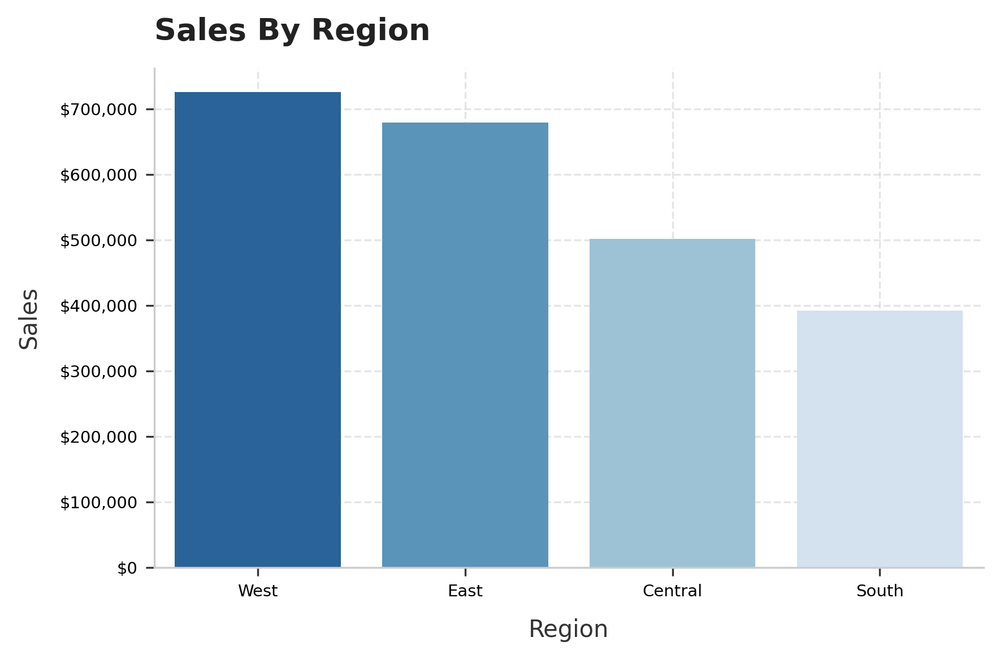
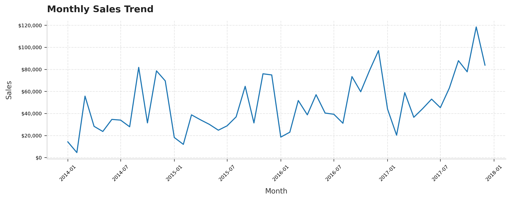
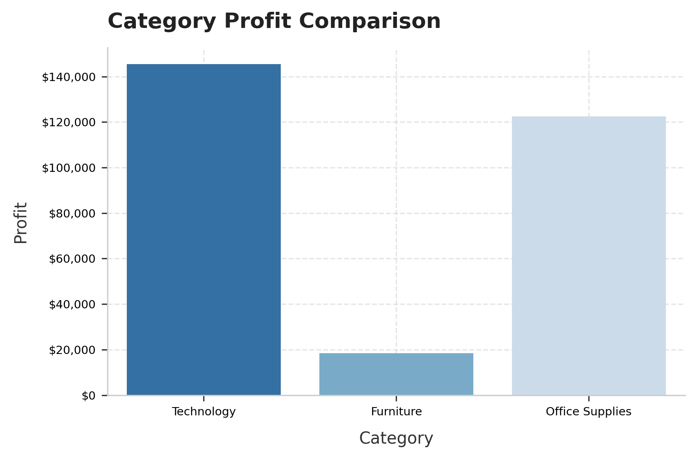
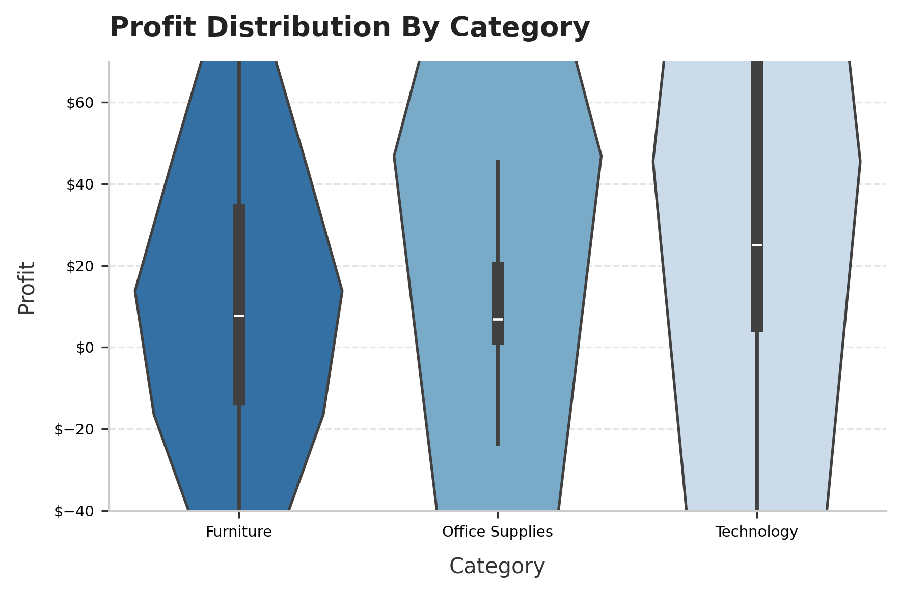

# Retail Sales Performance Analysis

**Live Pakistan Data Analytics Internship — Week 1 of 4**

Analysis of a retail superstore's sales data to identify which product categories, regions, and products are driving profit and which are quietly losing money.

## Tools Used
- **Python (pandas):** data cleaning, aggregation, KPI calculation
- **Matplotlib & Seaborn:** data visualization
- **Jupyter Notebook**

## Dataset
[Superstore Sales Dataset (Kaggle)](https://www.kaggle.com/datasets/vivek468/superstore-dataset-final)  9,994 orders, 21 columns, no missing values or duplicates.

## Key Findings

- **Overall:** `$2.30M` in total sales generated `$286K` in profit with a `12.47%` margin.
- **Category red flag (Furniture):** Generates `$742K` in sales (comparable to Technology) but converts almost none of it into profit just a `2.49% margin`, vs. `17.40% for Technology`. A violin plot of profit distribution shows this isn't consistent underperformance but high inconsistency individual orders swing between solid profit and real losses.
- **Region red flag (Central):** Generates more revenue than South `($501K vs $392K)` but converts far less of it into profit `(7.92% margin vs. South's 11.93%)` it is a clear efficiency gap.
- **Unprofitable best sellers:** Two products in the top 5 by revenue the `Cisco TelePresence System EX90` and `HON 5400 Series Task Chairs` are unprofitable or breakeven despite strong sales volume.
- **Chronic low margin products:** 5 products carry consistently negative profit margins across three departments, though total financial exposure per product stays under `$1,000` due to low sales volume.
- **Seasonality:** Sales peak sharply in `Q4 (Oct–Dec)` each year and dip in `Q1`, pointing to a recurring seasonal demand pattern rather than steady organic growth.

## Repository Structure
```
├── data/
│   ├── raw/                  # Original dataset (untouched)
│   └── processed/            # Cleaned dataset, exported after preprocessing
├── notebooks/
│   └── retail_sales_analysis.ipynb   # Full analysis: cleaning → KPIs → products → visuals
├── visuals/                  # Exported chart PNGs
├── reports/
│   └── insights_report.md    # Half-page management insights & recommendations
└── README.md
```

## Visualizations
### Sales by Region 


### Monthly Sales Trend


### Category Profit Comparison


### Profit Distribution by Category


## Author
Beshair Khan 

Data Analytics Intern, Live Pakistan